# T3A2-A - Full Stack App (Part A)

## Sarah Landis & Connie Jacques Present Hope Hunters: A Missing Persons Aggregate Site

---
### Documentation

#### 1. About
##### Purpose
Each year, approximately 40,000 people are reported missing in Australia - that's one person every 18 minutes[^1]. Unfortunately, not all of these cases are exposed to the public in a timely manner, if at all. The more people who are aware of a recently missing person, the greater the likelihood is of finding them. 

The purpose of this website is to provide a platform for both members of the general public and law enforcement to post and share information about missing persons in New South Wales. Allowing members of the public to engage with reports and share details via social media about missing persons will increase the chances of locating the missing persons by engaging a wider network of individuals and organisations, therefore decreasing the amount of time it takes to distribute key information.

The use of this website will hopefully assist in reuniting families, bringing closure to loved ones, and raising awareness about missing persons cases in NSW. Every effort in the search counts and matters, and as a community using this site, we can all do our part to help.

##### Functionality
Users are divided into two groups: members of the general public and Police, where a Police account will belong to a local police station rather than an individual officer. To sign up for an account, general users will be required to provide their full name, a valid, unique email address and a password. Police users will need to provide the station name, police area command, police district, email address (must contain @police.nsw.gov.au) and a password. Users will then be sent a verification link to the email address they provided and will be unable to sign in until they clicked the link to verify their email address. This will also prevent bots from creating user accounts.

Once they have sign up, users will be able to log in with their email and password. A JSON web token which is valid for seven days will be added to their document in the database when they click on the verification link sent to their email address. On each log in the expiry date for this token will be updated, meaning that if the user is active again within seven days they will not need to log in again. 

When logged in, all users will have access to a personalised dashboard where they will be able view their four most recent listings, a search bar if more than four listings exist, options to update or delete their listings, and update their user account details or delete their account. As admin and police users will have the ability to update or delete any missing person listing, they will likely need to use the search bar to locate the listing they wish to modify. 

Logged in users will be able to add missing persons listings. A listings must contain the individual's full name and age, and can also contain a url to a photo, the date they were last seen, current age, the area they are suspected to be in, last known location, hair colour, eye colour, complexion, height, weight, gender, distinctive features and amber alert status. Missing persons listings can also be deleted and updated to contain information not added initially.

The goal of the Hope Hunters website means that any member of the public will be able to view all missing persons listings. These listings will be displayed on the homepage and will be in the style of a Facebook newsfeed style continuous list with a hidden scrollbar. Listings on the homepage will be displayed in chronological order with the newest listings first, and a drop down menu will be available to optionally sort the listings by name (A - Z), location (A - Z), age (ascending or descending) or date (oldest first). A search bar will able be available to to search by location, name, police district, police area command, amber alert status, age, gender, complexion, area suspected to be and last seen (postcode).

##### Features

###### <i>Features required to achieve the above functionality, which comprises the minimum viable product, include:</i>

- <i>Sign up form</i>: The sign up form will have functionality to allow the user to identify as law enforcement. If the user selects this option, the form will change to accommodate sign up for police as different details are required. On sign up, the user will receive an email containing a link to verify their email address and complete their sign up. Once signed up the user will be redirected to sign in.
>
- <i>Sign in form</i>: This form will request the same email address and password used to sign up.
>
- <i>User's dashboard</i>: logged in users will have access to a personalised dashboard which will display the four most recent missing persons listings associated with their account and a search bar, as well as provide access a form to update or delete their account.
>
- <i>Update/delete account form</i>: This form will allow a user to update the details on record for their account. The form will include a button to delete the account. If updating, any fields left blank will remain as whatever is stored in the database (i.e. only filled fields will be updated). 
>
- <i>Add missing person form</i>: This form will be the same regardless of account type. The form fields will be based off the ERD attached below.
>
- <i>Update/delete missing person form</i>: This form will enable authorised users to update or delete a missing persons listing. The user will be required to locate the appropriate listing either their dashboard or via the homepage. Once they have located the listing, if they are authorised to modify the listings, they will be redirected to the form. The form will be same form used to add a missing person but on saving will be update only the modified fields in the database. There will be a button to delete the listing entirely.
>
- <i>Password encryption:</i> user's passwords will be hashed and salted in the front end before the data is attached in a request to the server. This will help to minimise the risk of a successful malicious attack in obtaining useful data.
>
- <i>Mongoose schemas to format models for collections in the database:</i> Data validation will be partly handled through the schemas to ensure consistency. Additional validation will be performed with the express-validator library. For example, express-validator will be used to ensure that a police user's email address will be required to contain the @police.gov.nsw.au postfix.
>
- <i>JWT authentication:</i> User documents in the database will be assigned a json web token with a seven day expiry on sign up. Their JWT will enable easy user authentication and will enable a user to remain logged in if they have used their account within the previous seven days, providing a nicer user experience.
>
- <i>Share a missing person listing to Facebook and by email:</i> All missing person's listings will contain the option to share directly Facebook or by email. User's will not be required to sign up to have access to this functionality.

###### <i>Nice to have features to enhance overall functionality of the site and increase quality of UX:</i>

- Directly share listings to additional social media outlets such as Twitter.
- Amber alert banner at the top of the home page with responsive infinite horizontal scrolling.
- Support page with crime stoppers info, grief support, mental health resources, etc.
- Option for a user to reset their password if they have forgotten it.
- Retrieve 30 listings at a time from the database for the continuous page. Only once they’ve been viewed, get the new 30, etc.
- Store missing persons images directly to database instead of a url to an image hosted on, for example, Photobucket. 

##### Target Audience
The target audience for this site, as briefly explained above, is the general public. With police busy with major crimes across different sectors and far too many annual missing person cases being filed, this site aims to enlist the assistance and knowledge of the general public.

In today's interconnected digital world there lies strength in numbers. The power and gravity of collective action is important to understand in this context. With social media acting as a catalyst, the swift dissemination of information is made much easier, and is hopefully able to play a crucial role in assisting someone's safe return home. Additionally, having direct access to share a listing to social media may be a lifesaver. You may not know the missing person, but social media contacts of yours may know them or have seen them. You never know how many connections away you are from a missing person, or whether someone you know has important information about them.

Our goal is to minimize the delay in information reaching the public, as well as in assisting law enforcement to pool together every possible avenue of a potential connection to better help locate a missing person.

##### Tech Stack
<i>Primary Programming Language:</i> 
JavaScript

<i>Front End:</i> 

- React
- HTML 
- CSS
- TailwindCSS
- Deployed to: GitHub Pages or Netlify

<i>Back End:</i>

- Server: Node
- Web Server Framework: Express
- ODM: Mongoose
- Deployed to: AWS EC2 Instance or Heroku 

<i>Database:</i>
MongoDB

- Deployed to: MongoDB Atlas

<i>Version Control:</i> 
Git

- Repository host: GitHub Organisation

<i>Text Editor:</i> VS Code

<i>Testing Frameworks:</i>

- Back end: Jest and Supertest
- Front End: React Testing Library

## 3. Application Architecture Diagram

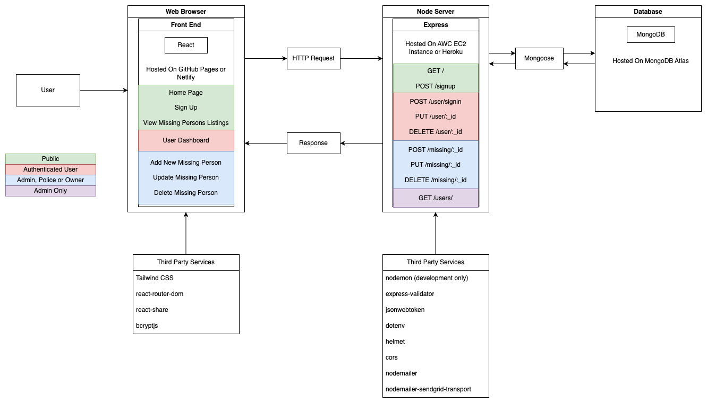

<i>Additional Dependencies:</i>

- Front end:
    - tailwindcss
    - react-router-dom
    - react-share
    - bcryptjs

- Back end:
    - nodemon (dev)
    - express-validator
    - jsonwebtoken
    - dotenv
    - helmet
    - cors
    - nodemailer
    - nodemailer-sendgrid-transport

An ERD is attached for the purpose of visualising the database schema/models that will be implemented.

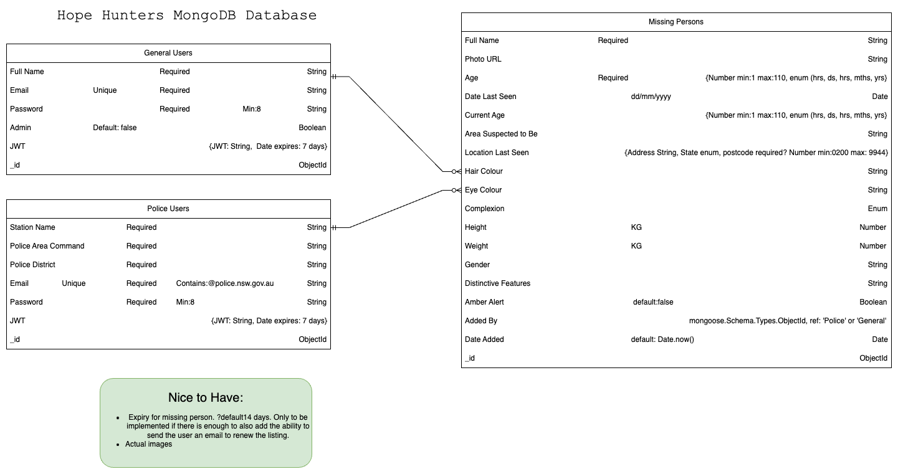

#### 2. Dataflow Diagram

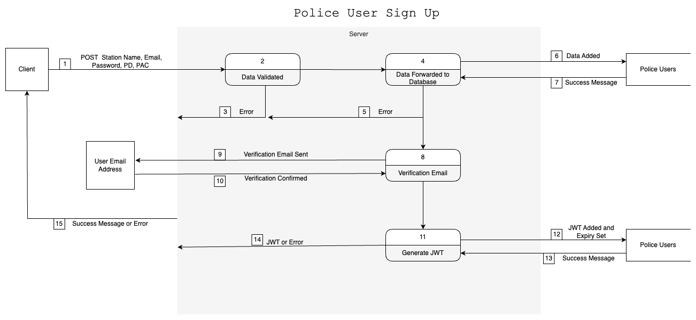

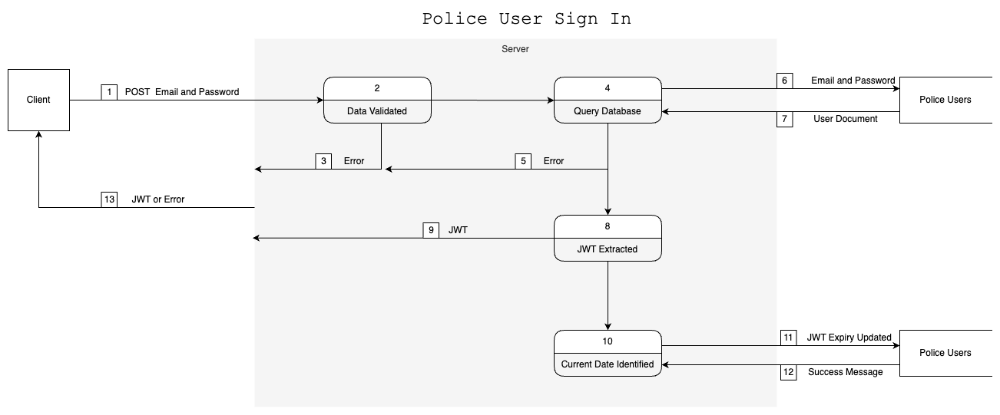

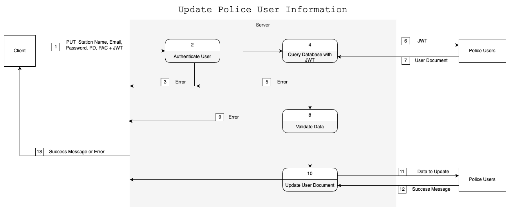
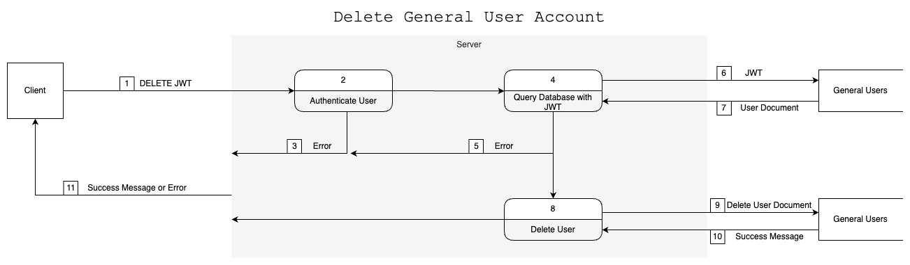

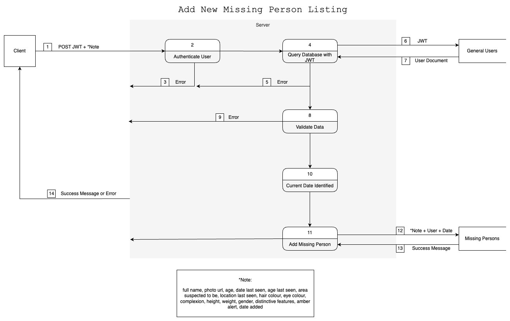
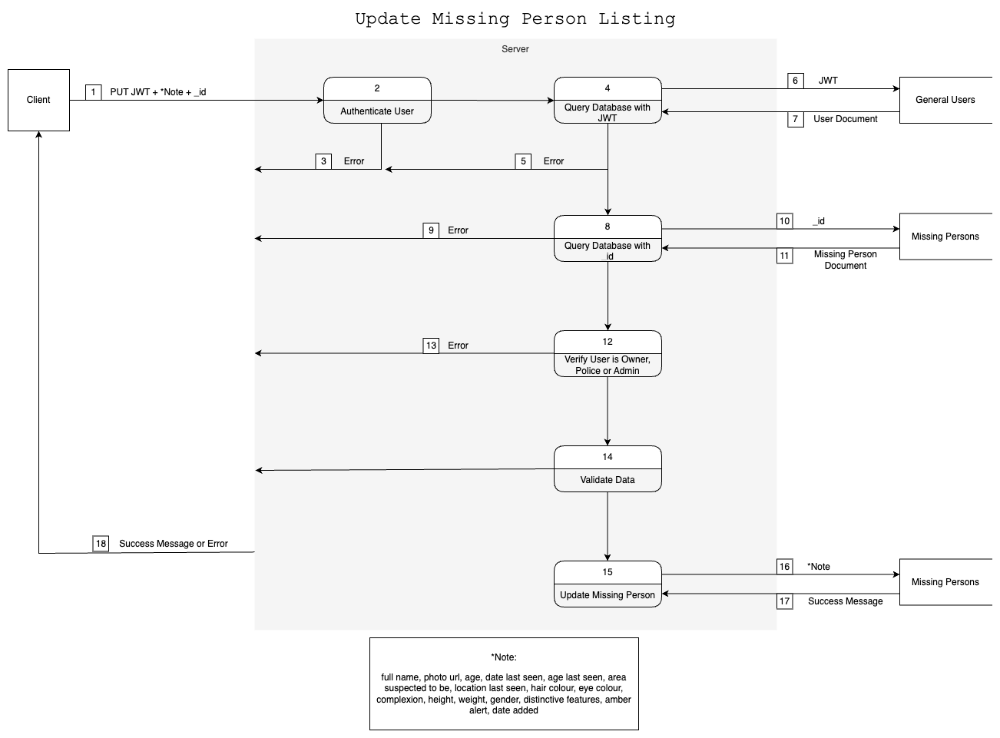
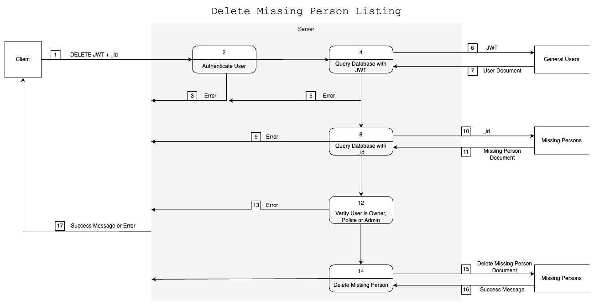
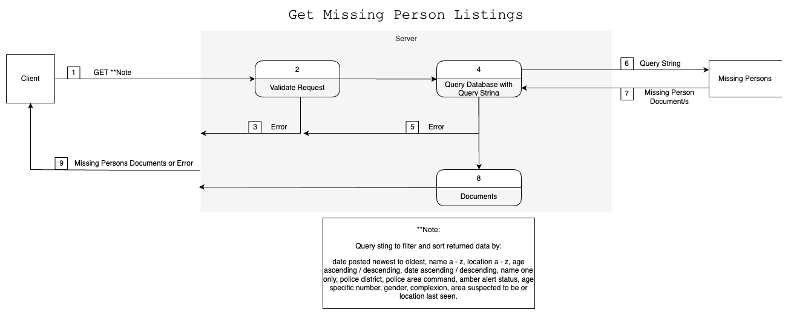

#### 3. Application Architecture Diagram

---
##### Design & Project Flow

#### 4. User Stories

#### 5. Design Processes & Wireframing

#### 6. Project Management
The kanban project management style will be followed to structure the implementation of each step in undertaking this project. This style has been chosen because it will enable our team to visualise what tasks need to be undertaken, what is underway, what individual team members need to review, and what has been completed. Being able to see what has been done can help to foster a sense of accomplishment and provide motivation to keep going. And. by dividing tasks up into very small snippets that can be completed in a few hours, the list of remaining tasks does not seem so daunting and thus can allow team members to remain motivated and inspired. 

Our team has created a trello board to enable us to visualise this information. Our board is divided into seven columns: Part A To Do, Part B To Do, Connie In Progress, Sarah In Progress, Under Review, Completed, and Nice to Have. This structure was chosen to best facilitate visualisation of who is doing what currently and to aid in the prioritisation of tasks. Each card on the board contains a title, may include the name to the team member/s who have chosen to undertake the task, a colour indicated the estimated time it will take to complete the card (the key for this colour system can be found in the board's description) and a detailed description of what needs to be done. As tasks are undertaken and completed the are moved to the next appropriate column.

The flexibility of the kanban management style will enable our team members to review and return to tasks that have been completed with ease, should further work or revision be needed during the course of the project.

In addition to use of the trello board our team will be hosting daily check-ins on Discord and will be continuous contact via Discord. This will enable team members to share their progress, request assistance, discuss additional requirements, ask clarifying questions, and generally support each other.

Our trello board can be found here: https://trello.com/b/7NMGHoN7/full-stack-app

<i>Trello Board Description</i>

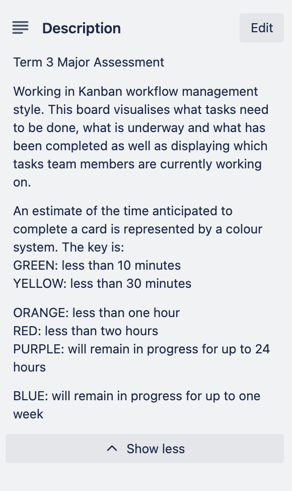
 
<i>Trello Board Progress Screenshots</i>

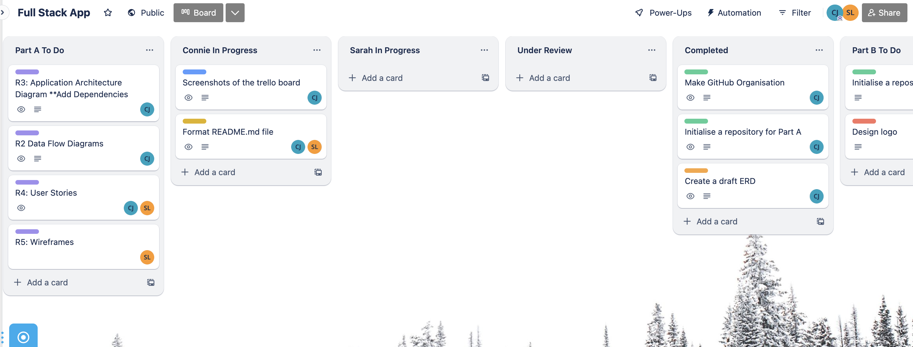
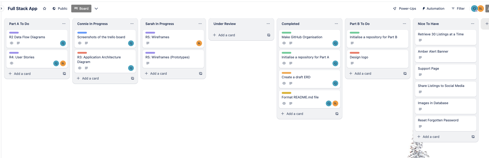
 
<i>Trello Board Card Examples</i>

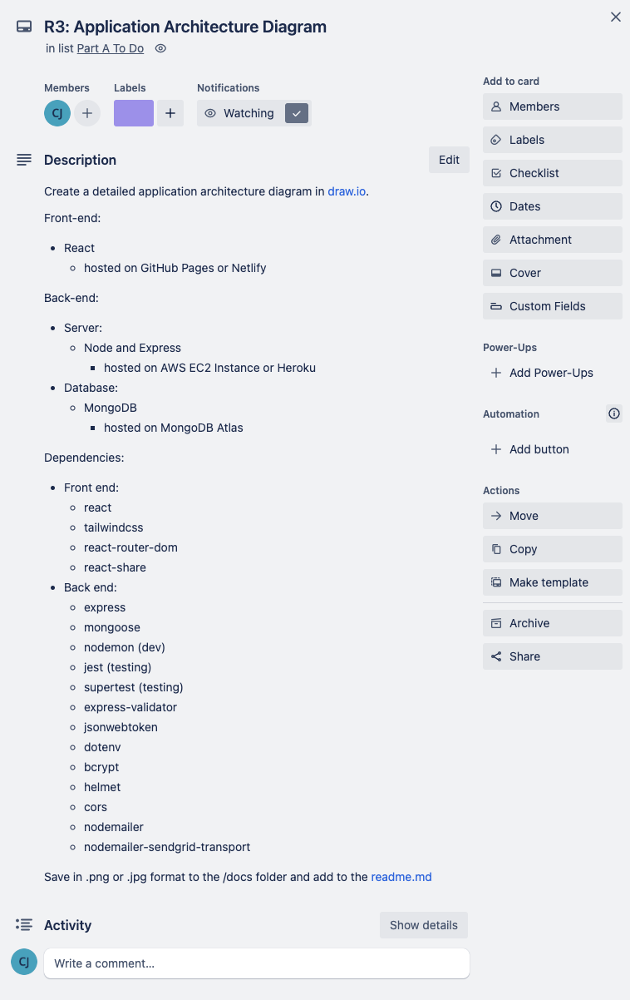

#### Sources Used: 
[^1]: Henderson, M., Henderson, P. and Kiernan, C. (2000). Missing Persons: Incidence, Issues and Impacts. [online] Available at: https://www.aic.gov.au/sites/default/files/2020-05/tandi144.pdf.

